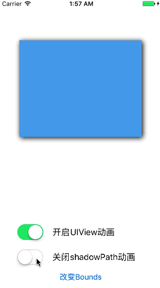
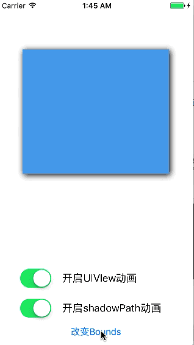

>本项目为个人博客["让CALayer的shadowPath跟随bounds一起做动画改变"](http://wty.im/2016/09/26/let-shadow-path-animate-with-layer-bounds/)的Demo

## 前言
在iOS开发中，我们经常需要给视图添加阴影效果，最简单的方法就是通过设置CALayer的shadowColor、shadowOpacity、shadowOffset和shadowRadius这几个属性可以很方便的为 UIView 添加阴影效果。但是如果单用这几个属性会导致离屏渲染(Offscreen Rendering)，而且CoreAnimation在每一帧绘制阴影的时候都需要递归遍历所有sublayer的alpha通道从而精确的计算出阴影的轮廓，这是非常消耗性能的，从而导致了动画的卡顿。

为了尽可能地减小离屏渲染带来的性能影响，我们可以利用CALayer的另外一个属性shadowPath，这个属性的官方文档是这么描述的：
> If you specify a value for this property, the layer creates its shadow using the specified path instead of the layer’s composited alpha channel. The path you provide defines the outline of the shadow. It is filled using the non-zero winding rule and the current shadow color, opacity, and blur radius.

可以看到设置了这个属性以后CALayer在创建其shadow的时候不在遍历sublayer的alpha通道，而是直接用这个属性所指定的路径作为阴影的轮廓，这样就减少了非常多的计算量。

然而这里会有一个问题，shadowPath并不会跟随CALayer的bounds属性进行变化，所以在layer的bounds产生变化以后需要手动更新shadowPath才能让其适配新的bounds。

为了解决这个问题，在使用AutoLayout以前，因为bounds都是手动计算出来的，我们可以很容易的直接设定新的shadowPath，而使用了AutoLayout以后，我们则只能在UIView的`layoutSubivews`方法中才能获得更新后的bounds。

而且文档中还做了如下描述：
> Unlike most animatable properties, this property (as with all CGPathRef animatable properties) does not support implicit animation. 

这说明该变量是不支持隐式动画的，也就是说当我们直接设置CALayer的shadowPath属性后，系统并不会自动的提交隐式的CATransaction动画。

为了解决了这个问题，我们需要通过CABasicAnimation显示地指定shadowPath的动画效果，同时为了和bounds的动画效果保持一致，我们需要获取bounds的动画属性。

考虑了以上两点问题以后，我们就可以用如下方法实现让CALayer的shadowPath跟随bounds一起做动画改变。

要特别注意一点的是，在iOS8以后bounds的隐式动画默认是开启additive模式的，而CALayer的shadowPath属性并不支持additive模式，所以如果在前一个shadowPath动画执行完毕前如果提交了新的动画，使用本方法将会看到shadowPath和bounds的动画不一致的现象。在Demo中可快速点击改变Bounds的按钮来复现该现象。

## 实现方法
为实现本文的思路，我们需要创建一个一个UIView的子类并且重写其`layoutSubivew`方法。

```objc
// Subclass of UIView
- (void)layoutSubviews {
    [super layoutSubviews];
    if (self.shouldAnimateShadowPath) {
        CAAnimation *animation = [self.layer animationForKey:@"bounds.size"];
        if (animation) {
            // 通过CABasicAnimation类来为shadowPath添加动画
            CABasicAnimation *shadowPathAnimation = [CABasicAnimation animationWithKeyPath:@"shadowPath"];
            // 根据bounds的动画属性设置shadowPath的动画属性
            shadowPathAnimation.timingFunction = animation.timingFunction;
            shadowPathAnimation.duration = animation.duration;
            // iOS8 bounds的隐式动画默认开启了additive属性，当前一次bounds change的动画还在进行中时，
            // 新的bounds change动画将会被叠加在之前的上，从而让动画更加顺滑
            // 然而shadowPath并不支持additive animation，所以当多个动画叠加，将会看到shadowPath和bounds动画不一致的现象
            // shadowPathAnimation.additive = YES;
            
            // 设置shadowAnimation的新值，未设置from，则from属性将默认为当前shadowPath的状态
            shadowPathAnimation.toValue = [UIBezierPath bezierPathWithRect:self.layer.bounds];
            
            // 将动画添加至layer的渲染树
            [self.layer addAnimation:shadowPathAnimation forKey:@"shadowPath"];
        }
        // 根据苹果文档指出的，显式动画只会影响动画效果，而不会影响属性的的值，所以这两为了持久化shadowPath的改变需要进行属性跟新
        // 同时也处理了bounds非动画改变的情况
        self.layer.shadowPath = [UIBezierPath bezierPathWithRect:self.layer.bounds].CGPath;
    }
}
```

## Demo



可以看到当关闭shadowPath动画，也就是不执行上述代码的时候，当view的bounds改变以后shadowPath还为原来的值，并未跟随bounds进行改变。



可以看到当打开shadowPath动画，也就是要执行了上述代码时，当view的bounds改变以后shadowPath能够跟随一起改变，而且动画效果相同。

---
>本文个人博客地址: [http://wty.im/2016/09/26/let-shadow-path-animate-with-layer-bounds/](http://wty.im/2016/09/26/let-shadow-path-animate-with-layer-bounds/) 

>Github: [https://github.com/wty21cn/](https://github.com/wty21cn/)

